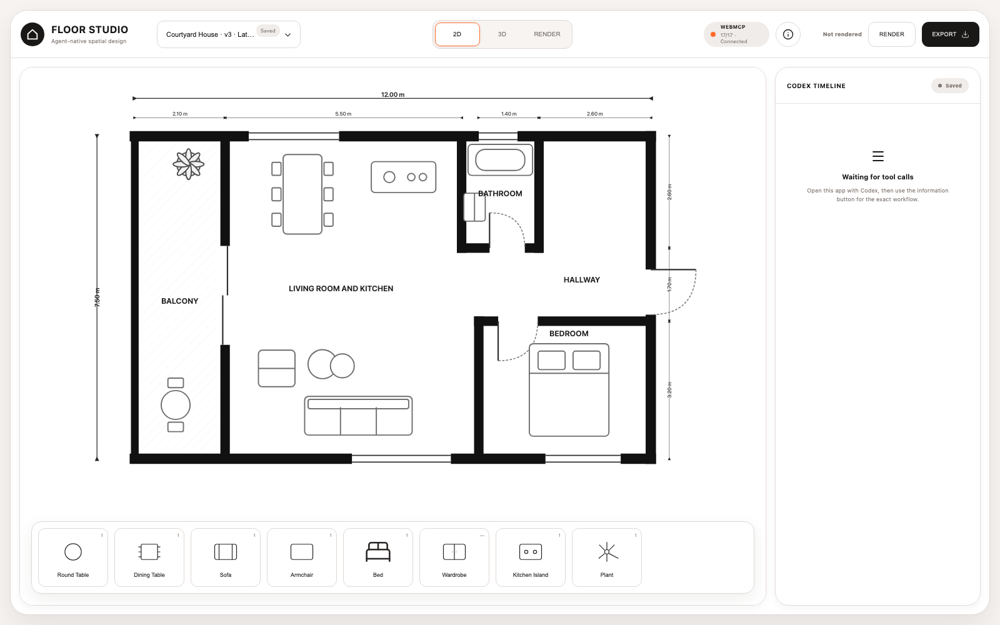
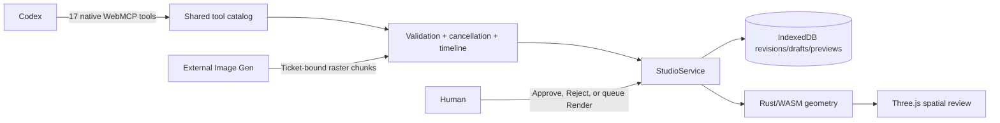

# Floor Studio

Floor Studio is a static, local-first residential spatial review app for a human working with Codex through native WebMCP. Codex authors deterministic metric changes through task-oriented `floor.*` tools; the page renders the result, records the tool timeline, and reserves approval or rejection for the local human.

The application uses React, TypeScript, React Three Fiber/Three.js, a Rust/WebAssembly geometry core, and IndexedDB. It has no application server, embedded API key, account system, or cloud database.

**Live demo:** [kreddevils18.github.io/floor-studio-webmcp](https://kreddevils18.github.io/floor-studio-webmcp/)



## Local development

Requirements: [Bun](https://bun.sh/) 1.3.6+, Rust stable with `wasm32-unknown-unknown`, and a modern browser. Native WebMCP requires a compatible browser; unsupported browsers keep the spatial review UI usable and report that tools are unavailable.

```bash
bun install
bun run wasm:build
bun run dev
```

Quality gates:

```bash
cargo test --locked --manifest-path wasm/floor-core/Cargo.toml
bun run check
bun run test:coverage
bun run build
bun run test:e2e
```

## Agent workflow

Open the app in a native WebMCP-capable browser, then ask Codex:

> Open the living room to the courtyard with a 1.8 m sliding door. Keep a clear 900 mm circulation path from the entry to the kitchen. Apply warm oak flooring and mineral plaster. Validate the plan and present the draft for my approval.

Floor Studio exposes exactly 17 tools for project context, transactional layout/style changes, validation, presentation, focus, queued render jobs, and bounded raster upload. There is deliberately no approval tool. A valid presented draft exposes local **Approve** and **Reject** controls; the visible project state is only **Draft** or **Saved**.

The one-screen shell has **2D**, **3D**, and **Render** tabs. The default 2D view is a technical plan; 3D is a lazy-loaded Three.js isometric view of the same document; Render shows one revision/mode-bound Image Gen artifact. The horizontal component rail focuses matching furniture without exposing manual authoring. **Export** downloads the selected 2D/3D render and never exports project JSON.

```text
Codex reads context → opens a revision-bound change → stages layout/style
→ validates → presents → human approves/rejects locally
→ human queues 2D/3D Render → Codex reads and claims the job
→ Image Gen runs externally → Codex uploads the verified raster preview
```

| Tools | Trust/side-effect classification |
| --- | --- |
| `floor.get_context`, `floor.list_entities`, `floor.validate_change`, `floor.get_change_status` | Read-only; outputs are untrusted |
| `floor.create_project`, `floor.begin_change`, `floor.apply_layout`, `floor.apply_style`, `floor.present_change`, `floor.discard_change`, `floor.focus` | Mutating; trusted structured output |
| `floor.get_render_job` | Read-only queued-job discovery; output is untrusted |
| `floor.claim_render_job` | Mutating claim; output contains the untrusted render prompt and capture target |
| `floor.preview_begin`, `floor.preview_chunk`, `floor.preview_commit`, `floor.preview_abort` | Mutating bounded upload lifecycle |



## Data, migration, and privacy

Projects, immutable saved revisions, drafts, typed agent timeline events, render tickets, preview metadata, and preview blobs stay in browser IndexedDB. Database schema version 3 removes the obsolete request/activity stores without deleting project or revision data. Started tool events left by a reload recover as failed `INTERRUPTED` events. Legacy preview tickets are normalized to the queued/rendering lifecycle on load.

Preview uploads accept PNG, JPEG, and WebP only, enforce ordered bounded chunks, declare a byte count and SHA-256 digest, and use a project/revision/render-mode-bound ticket. Version selection is read-only; the newest revision is always listed first and history is locked while a draft is active.

See [docs/demo-script.md](docs/demo-script.md) for the complete demo and [docs/system-architecture.md](docs/system-architecture.md) for boundaries and invariants.
